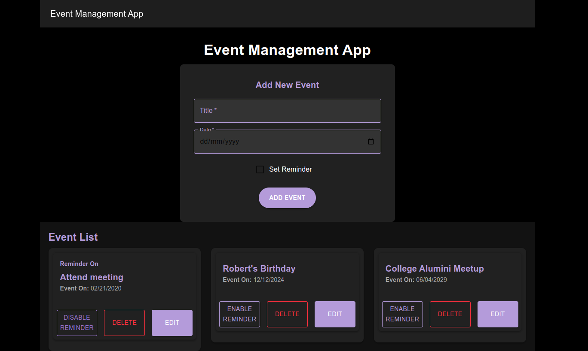

# Event Management Application (MERN Stack)

## Overview

This is an Event Management Application built using the MERN stack (MongoDB, Express.js, React.js, Node.js). The application allows users to:

- **Create Events**: Add new events with a title, description, date, and time.
- **Update Events**: Modify details of existing events.
- **Delete Events**: Remove events from the list.
- **Event Reminders**: The app will remind users of events happening today.

The application is structured with a separate **frontend** and **backend** codebase, communicating via a RESTful API.





## Features

- **CRUD operations** for managing events:
  - Create, Read, Update, and Delete events.
- **Event reminders**: Notify the user when an event is scheduled for today.
- User-friendly interface built with React.js.
- RESTful API built with Express.js and Node.js.
- Data storage in MongoDB.

## Tech Stack

- **Frontend**: React.js, CSS, Axios (for API requests), Material UI
- **Backend**: Node.js, Express.js
- **Database**: MongoDB
- **Authentication**: (Optional) JWT for authentication (if needed)
- **Date & Time Management**: Moment.js or date-fns

## Prerequisites

- **Node.js** (version 14.x or later)
- **MongoDB** (locally or cloud service like MongoDB Atlas)

## Project Structure

```
event-management-app/
├── frontend/               
│   ├── src/
│   │   ├── components/     
│   │   ├── App.js          
│   │   └── index.js        
│   ├── public/
│   └── package.json         
├── backend/                 
│   ├── models/             
│   ├── routes/              
│   ├── app.js               
│   └── package.json         
└── README.md                
```

---

## Installation

### Backend Setup

1. **Navigate to the backend directory**:
   ```bash
   cd backend
   ```

2. **Install backend dependencies**:
   ```bash
   npm install
   ```

3. **Set up environment variables** (if needed):
   - Create a `.env` file in the `backend` directory and add your MongoDB URI, e.g.:
     ```env
     MONGODB_URI=mongodb://localhost:27017/eventdb
     PORT=5000
     ```

4. **Run the backend server**:
   ```bash
   npm start
   ```
   The server will run on `http://localhost:5000` (or the port you specify in `.env`).

---

### Frontend Setup

1. **Navigate to the frontend directory**:
   ```bash
   cd frontend
   ```

2. **Install frontend dependencies**:
   ```bash
   npm install
   ```

3. **Run the React development server**:
   ```bash
   npm start
   ```
   The frontend will be available at `http://localhost:3000`.


## Usage

1. **Create Events**: 

   - Navigate to the "Create Event" page and fill in the event details (name, description, date, time).
   - Submit the form to create an event.

2. **View Events**: 

   - The event list will display all events with their details. Events happening today will be highlighted.

3. **Update Events**: 

   - Click on an event to view its details and make changes.

4. **Delete Events**: 

   - Click the "Delete" button next to an event to remove it from the system.

5. **Event Reminders**: 

   - The app will automatically notify you if an event is happening today.

## API Endpoints (Backend)

The backend exposes the following RESTful API endpoints:

### GET `/api/events`

- Fetch all events.
  
### POST `/api/events`

- Create a new event.
  - **Request Body**:

    ```json
    {
      "title": "Event Name",
      "description": "Event Details",
      "date": "2025-01-03T12:00:00",
      "reminder": true
    }
    ```

### PUT `/api/events/:id`

- Update an existing event by ID.

### DELETE `/api/events/:id`

- Delete an event by ID.

## Event Reminders

The application checks the current date and compares it with the event date. If the event is scheduled for today, a reminder message will be shown on the frontend.

## License

This project is licensed under the GNU General Public License (GPL) v3 - see the [LICENSE](LICENSE) file for details.

